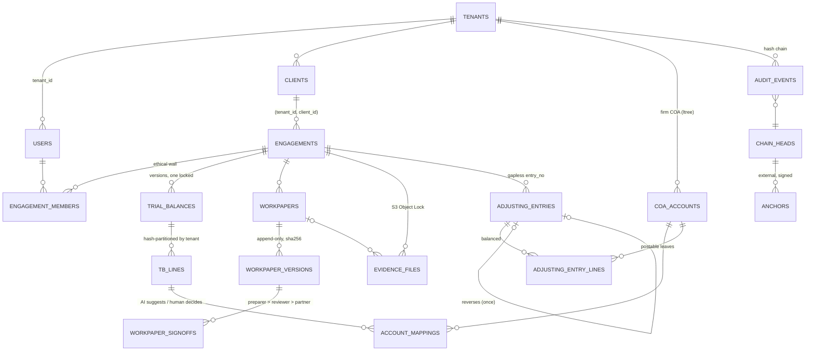

# 04 — Data Model & Indexing Strategy

DDL: `db/migrations/V0003__core_schema.sql` (tables), `V0004` (RLS), `V0005` (integrity), `V0006` (audit chain), `V0007` (roll-ups), `V0009` (authn).

## Entity-relationship overview

Every relationship between tenant-owned tables is a **composite** foreign key starting with `tenant_id`. Where a child carries a denormalized `engagement_id`, the FK includes it: `(tenant_id, parent_id, engagement_id) → parent(tenant_id, id, engagement_id)`.

## Keys & constraints worth knowing

| Table | Notable constraints |
|---|---|
| `users` | Unique `(tenant_id, idp_subject)`, `(tenant_id, lower(email))`; staff ⇔ rank; an active human must have MFA |
| `engagements` | Materiality ordering (CTT ≤ PM ≤ OM); `report_date > period_end`; `assembly_deadline = report_date + 60` (generated, ISA 230.A21); archived ⇔ `archived_at` |
| `trial_balances` | One `locked` per `(engagement, kind)` (partial unique index); source object key bound to the tenant prefix; control totals; `lines_sha256` |
| `account_mappings` | One `accepted` per line (partial unique); LLM/embedding suggestions require `model_ref`; decided ⇔ `decided_by/at` |
| `workpaper_signoffs` | Unique `(version_id, level)`; content hash must match the version |
| `evidence_files` | `object_key` must live under `tenants/<tenant>/engagements/<engagement>/`; size ≤ 5 GiB; scan verdict ⇔ `scanned_at` |
| `adjusting_entries` | Unique `(engagement, entry_no)`; PAJE never posted; approver ≠ preparer; single non-rejected reversal per entry |

## Indexing strategy for balance roll-ups

The FS pipeline is: **locked TB lines → accepted mappings → COA leaves → + posted AJE/RJE lines → ltree ancestors.**

| Access path | Index | Why |
|---|---|---|
| Sum a TB | `tb_lines (tenant_id, trial_balance_id) INCLUDE (closing_balance, period_debit, period_credit)` | Index-only scan for control totals, lock checks and roll-ups |
| TB line → mapping | `account_mappings (tenant_id, trial_balance_id, coa_account_id) INCLUDE (tb_line_id) WHERE status='accepted'` | Partial: ignores suggestions/rejections (the bulk of rows) |
| AJE roll-up | `adjusting_entry_lines (tenant_id, engagement_id, coa_account_id) INCLUDE (amount, entry_id)` + `adjusting_entries (tenant_id, engagement_id, entry_type) WHERE status='posted'` | Posted-only partial index keeps drafts out of the hot path |
| Balanced check at posting | `adjusting_entry_lines (tenant_id, entry_id) INCLUDE (amount)` | Sum of one entry is a tiny index-only scan |
| Hierarchy | `coa_accounts UNIQUE (tenant_id, path)` + `GiST (path)` | `fs_rollup` explodes each balance to its ancestors (`subpath`) and **hash-joins on path equality**: O(accounts × depth) instead of an O(n²) `<@` scan; GiST serves ad-hoc subtree queries |
| Ethical wall | `engagement_members (tenant_id, user_id, engagement_id) WHERE removed_at IS NULL` | Feeds the hashed SubPlan used by every walled policy |
| Engagement lists | `engagements (tenant_id, client_id, period_end DESC)`, `(tenant_id, stage) WHERE stage <> 'archived'` | Dashboards skip the archive |
| Audit trail | `audit.events (tenant_id, engagement_id, occurred_at)`, `(tenant_id, table_name, row_id)` | Engagement timeline; per-record history |

**Partitioning.** `tb_lines` (the only high-volume table in Phase 1) is `PARTITION BY HASH (tenant_id)` with 8 partitions (grow to 32/64 by re-partitioning offline). The RLS predicate supplies `tenant_id` as a runtime parameter, so the executor prunes to one partition. In Phase 5, GL detail for JE testing will be range-partitioned by period inside each tenant hash partition.

**Why no materialized views.** They cannot enforce RLS. Snapshots of adjusted balances per FS version (Phase 4) will be ordinary RLS'd tables written by the service principal, keyed `(tenant_id, engagement_id, fs_version, coa_account_id)`.
